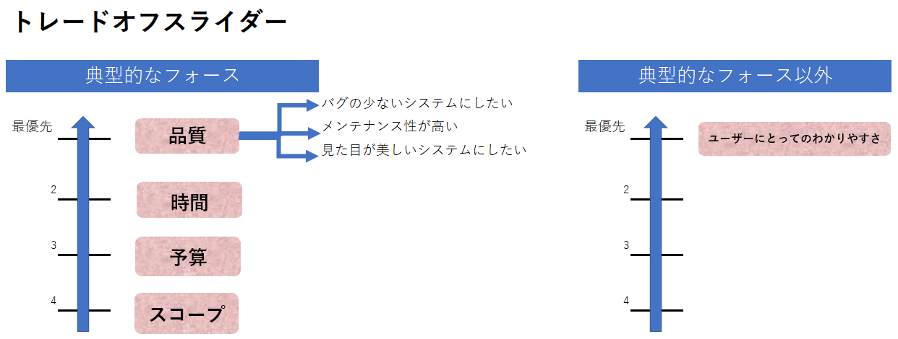

## The Elevator Pitch

* 「社内の申請をペーパーレス化し効率よく」したい
* 「社内メンバー」向けの、
* 「approval-system」は、
* 「社内申請ワークフローシステム」です。
* これは「社内申請をシステム上で完了させることが」でき、
* 「従来の申請業務」と違って、
* 「承認ルートや申請ごとの項目をメンテナンス可能な仕組み」が備わっている。

## Why are we here?

* 申請項目と承認ルートを管理できるシステムにする。
* 12月末までに開発・テストを完了する。(納品後、1月末までに受入テストを完了する）
* 社内でシステムのメンテナンスができる。
* 内製化の実績をつくる。
* **社内申請の承認フローを行えるようにする**

## Trade off sliders

