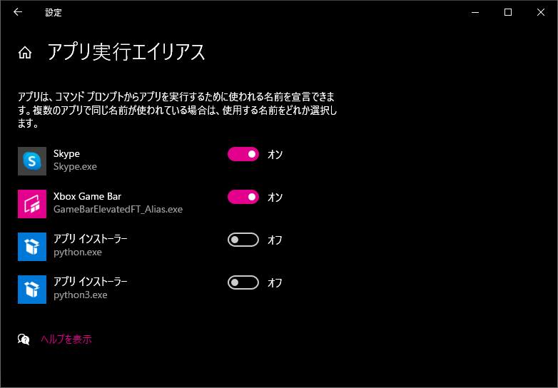

# ローカルPC用のツールをインストールします

プロジェクトを初期する前に、次のツールをインストールする必要があります。

- python
- Visual Studio Code
- Docker Descktop
- PostgreSQL 13
- Git
- [docker](https://docs.docker.com/engine/installation/)
- [docker-compose](https://docs.docker.com/compose/install/)
- [pyenv](https://github.com/pyenv/pyenv) (Linux, MacOS) ※Widowsの場合は不要
- [pyenv-virtualenv](https://github.com/pyenv/pyenv-virtualenv) (for Linux and MacOS) ※Widowsの場合は不要
- [pyenv-win](https://github.com/pyenv-win/pyenv-win) (Windows)
- [npm](https://nodejs.org/ja/)

# Power Shell実行ポリシーの設定

Power Shellを開いて以下のコマンドを実行する。

```bash
> Set-ExecutionPolicy Bypass -Scope CurrentUser
```

以下のコマンドを実行し実行ポリシーを確認する。

```bash
> Get-ExecutionPolicy -List

        Scope ExecutionPolicy
        ----- ---------------
MachinePolicy       Undefined
   UserPolicy       Undefined
      Process       Undefined
  CurrentUser          Bypass
 LocalMachine       Undefined
```
# データベース

#### 1. Dockerデータベースとキャッシングをデタッチモードで起動する:

```bash
PS C:\work\approval-system> docker-compose up -d
```

# バックエンド

### サービス

本プロジェクトには外部サービスを利用します。データベースの対してはPostgresを使用します。
 `docker-compose.yml` ファイル で定義されています。

## Windows

## pyenvインストール

#### 1. pipでpyenv-winをインストール

PowerShellからpipを使ってインストールする。

```bash

PS C:\work\approval-system> pip install pyenv-win --target $HOME\\.pyenv
```

#### 2. アプリ実行エイリアスでpythonのアプリインストーラーをオフにする。




#### 3. 環境変数を設定

PowerShellで以下のコマンドを実行して環境変数を設定する。

```bash

PS C:\work\approval-system> [System.Environment]::SetEnvironmentVariable('PYENV',$env:USERPROFILE + "\.pyenv\pyenv-win\","User")
PS C:\work\approval-system> [System.Environment]::SetEnvironmentVariable('PYENV_HOME',$env:USERPROFILE + "\.pyenv\pyenv-win\","User")
PS C:\work\approval-system> [System.Environment]::SetEnvironmentVariable('path', $env:USERPROFILE + "\.pyenv\pyenv-win\bin;" + $env:USERPROFILE + "\.pyenv\pyenv-win\shims;" + [System.Environment]::GetEnvironmentVariable('path', "User"),"User")
```

#### 4. PowerShellを一度再起動する

環境変数が反映されていない可能性があるのでPowerShellのウィンドウを一度閉じて再度開く。

```bash
exit
```

#### 5. pyenvバージョン確認

```bash

PS C:\work\approval-system> pyenv --version
pyenv 2.64.10
```

# virtualenvを使用してpython環境を準備します

#### 1. ローカルで実行するための仮想環境を作成する:

pyenvにpython3.9.5をインストールする。

```bash

PS C:\work\approval-system> pyenv install 3.9.5

Windows PowerShell
Copyright (C) Microsoft Corporation. All rights reserved.
:: [Info] ::  Mirror: https://www.python.org/ftp/python
:: [Downloading] ::  3.9.5 ...
:: [Downloading] ::  From https://www.python.org/ftp/python/3.9.5/python-3.9.5-amd64-webinstall.exe      
:: [Downloading] ::  To   C:\Users\parkh\.pyenv\pyenv-win\install_cache\python-3.9.5-amd64-webinstall.exe
:: [Installing] ::  3.9.5 ...
:: [Info] :: completed! 3.9.5
```

python3.9.5を使うように切り替える。

```bash
PS C:\work\approval-system> pyenv local 3.9.5
PS C:\work\approval-system> python --version
Python 3.9.5
```

pipでvenvをインストールする。

```
PS C:\work\approval-system> python -m pip install virtualenv
Collecting virtualenv
  Downloading virtualenv-20.7.2-py2.py3-none-any.whl (5.3 MB)
     |████████████████████████████████| 5.3 MB 6.8 MB/s
Collecting distlib<1,>=0.3.1
  Downloading distlib-0.3.2-py2.py3-none-any.whl (338 kB)
     |████████████████████████████████| 338 kB 6.4 MB/s
Collecting platformdirs<3,>=2
  Downloading platformdirs-2.3.0-py3-none-any.whl (13 kB)
Collecting backports.entry-points-selectable>=1.0.4
  Downloading backports.entry_points_selectable-1.1.0-py2.py3-none-any.whl (6.2 kB)
Collecting six<2,>=1.9.0
  Downloading six-1.16.0-py2.py3-none-any.whl (11 kB)
Collecting filelock<4,>=3.0.0
  Using cached filelock-3.0.12-py3-none-any.whl (7.6 kB)
Installing collected packages: six, platformdirs, filelock, distlib, backports.entry-points-selectable, virtualenv
Successfully installed backports.entry-points-selectable-1.1.0 distlib-0.3.2 filelock-3.0.12 platformdirs-2.3.0 six-1.16.0 virtualenv-20.7.2
WARNING: You are using pip version 21.1.1; however, version 21.2.4 is available.
You should consider upgrading via the 'C:\Users\parkh\.pyenv\pyenv-win\versions\3.9.5\python.exe -m pip install --upgrade pip' command.
```

venvで仮想環境を作成する。

```bash
PS C:\work\approval-system> python -m venv venv
```

Note: このようなエラーが出たときは`pyenv global 3.9.5`と実行する。

```
No global python version has been set yet. Please set the global version by typing:
pyenv global 3.7.2
```

仮想環境をアクティブにする。

```
.\venv\Scripts\activate
```

```
python -m pip install --upgrade pip
```

#### 2. Pythonパッケージをインストールする:

```bash
PS C:\work\approval-system> pip install -r approvalsystem/requirements/requirements.txt
Collecting asgiref==3.4.1
  Using cached asgiref-3.4.1-py3-none-any.whl (25 kB)
(省略)
Successfully installed Django-3.2.7 MarkupSafe-2.0.1 asgiref-3.4.1 certifi-2021.5.30 charset-normalizer-2.0.6 coreapi-2.3.3 coreschema-0.0.4 django-concurrency-2.
(省略)
```

ライブラリがインストールできたか確認する。

```
PS C:\work\approval-system> pip list
Package                       Version
----------------------------- ---------
asgiref                       3.4.1
certifi                       2021.5.30
charset-normalizer            2.0.6
coreapi                       2.3.3
coreschema                    0.0.4
Django                        3.2.7
django-concurrency            2.3
django-cors-headers           3.8.0
django-environ                0.6.0
django-extensions             3.1.3
djangorestframework           3.12.4
djangorestframework-simplejwt 4.8.0
drf-yasg                      1.20.0
idna                          3.2
inflection                    0.5.1
itypes                        1.2.0
Jinja2                        3.0.2
MarkupSafe                    2.0.1
packaging                     21.0
pip                           21.2.4
psycopg2-binary               2.9.1
PyJWT                         2.1.0
pyparsing                     2.4.7
pytz                          2021.1
requests                      2.26.0
ruamel.yaml                   0.17.16
ruamel.yaml.clib              0.2.6
setuptools                    56.0.0
sqlparse                      0.4.1
uritemplate                   3.0.1
urllib3                       1.26.7
```

#### 3. 「.env」ファイル作成

```bash
PS C:\work\approval-system> cd approvalsystem
PS C:\work\approval-system\approvalsystem> cp .\config\.env.example .\config\.env
```

作成された「.env」ファイルを開いて「192.168.1.4」の部分を自分のPCのローカルIPアドレスに編集する。

```
CORS_ALLOWED_ORIGINS=http://localhost:8080;http://127.0.0.1:8080;http://192.168.1.4:8080
```

#### 4. Djangoアプリを実行し、ブラウザーで `localhost：8000 ` pageをチェックする:

```bash
PS C:\work\approval-system\approvalsystem> python manage.py runserver
```

## LinuxもしくはMacOSの場合はこちらを参照

```bash

pyenv install 3.9.5
pyenv virtualenv 3.9.5 venv
pyenv local venv
pyenv activate venv
```

# フロントエンド

## node.js & npmインストール

[こちら](https://nodejs.org/ja/download/)からダウンロードした「Windows Installer (.msi)」を使ってインストールする。

※デフォルト設定で「next」でウィザードを進めてOK

## VueJSアプリケーション構築

Vuejsを独立して実行させるための環境です。

#### 1. パッケージをインストールする:

```bash
PS C:\work\approval-system\approvalsystem-ui> npm install
```

#### 2. VueJSアプリを実行し、ブラウザーで `localhost：8080` pageを確認する:

```bash
PS C:\work\approval-system\approvalsystem-ui> npm run serve
```

※2回目以降起動するときは`runserve.bat`をダブルクリックなどで実行すると便利です。
