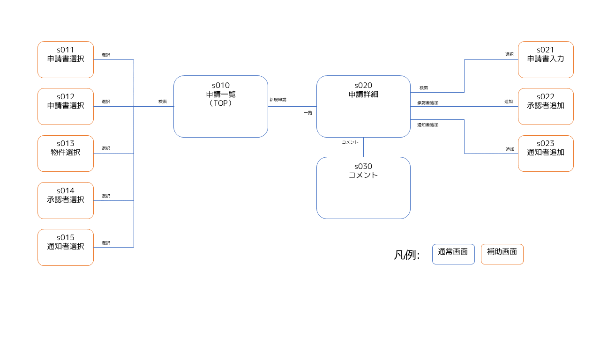

# 画面遷移図

# 画面一覧

## 通常

|画面ID|画面|概要|
|---|---|---|
|s001|ログイン|システムにログインできる。|
|s010|申請一覧|システムのトップ画面で、申請を検索できログイン者に関する通知を確認できる。|
|s020|申請詳細|該当申請に関して申請・承認することができる。|
|s030|コメント|該当申請に関して承認者と申請者がコメントをやりとりできる。|

## 入力補助

|画面ID|画面|概要|
|---|---|---|
|s011|申請書選択|申請一覧と申請詳細で検索対象の申請書を探し選択できる。|
|s012|申請者選択|申請一覧で検索対象の申請者を探し選択できる。|
|s013|物件選択|申請一覧で検索対象の物件を探し選択できる。|
|s014|承認者選択|申請一覧で検索対象の承認者を探し選択できる。|
|s015|通知者選択|申請一覧で検索対象の通知者を探し選択できる。|
|s021|承認者追加|申請詳細で承認者を承認ルートに追加できる。|
|s022|通知者追加|申請詳細で通知者を追加できる。|
