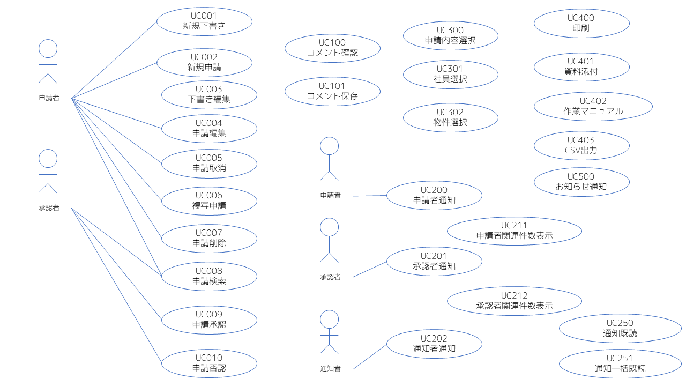

# シナリオ一覧

- [UC001 新規下書き](シナリオ_UC001新規下書き.md)
- [UC002 新規申請](シナリオ_UC002新規申請.md)
- [UC003 下書き編集](シナリオ_UC003下書き編集.md)
- [UC004 申請編集](シナリオ_UC004申請編集.md)
- UC005 申請取消
- [UC006 複写申請](シナリオ_UC006複写申請.md)
- [UC007 申請削除](シナリオ_UC007申請削除.md)
- [UC008 申請検索](シナリオ_UC008申請検索.md)
- [UC009 申請承認](シナリオ_UC009申請承認.md)
- [UC010 申請否認](シナリオ_UC010申請否認.md)
- [UC100 コメント確認](シナリオ_UC100コメント確認.md)
- [UC101 コメント保存](シナリオ_UC101コメント保存.md)
- [UC200 申請者通知](シナリオ_UC200申請者通知.md)
- UC201 承認者通知
- UC202 通知者通知
- [UC300 申請内容選択](シナリオ_UC300申請内容選択.md)
- [UC301 社員選択](シナリオ_UC301社員選択.md)
- [UC302 物件選択](シナリオ_UC302物件選択.md)
- [UC400 印刷](シナリオ_UC400印刷.md)
- [UC401 資料添付](シナリオ_UC401資料添付.md)
- UC402 作業マニュアル
- [UC403 CSV出力](シナリオ_UC403CSV出力.md)
- UC500 お知らせ通知
