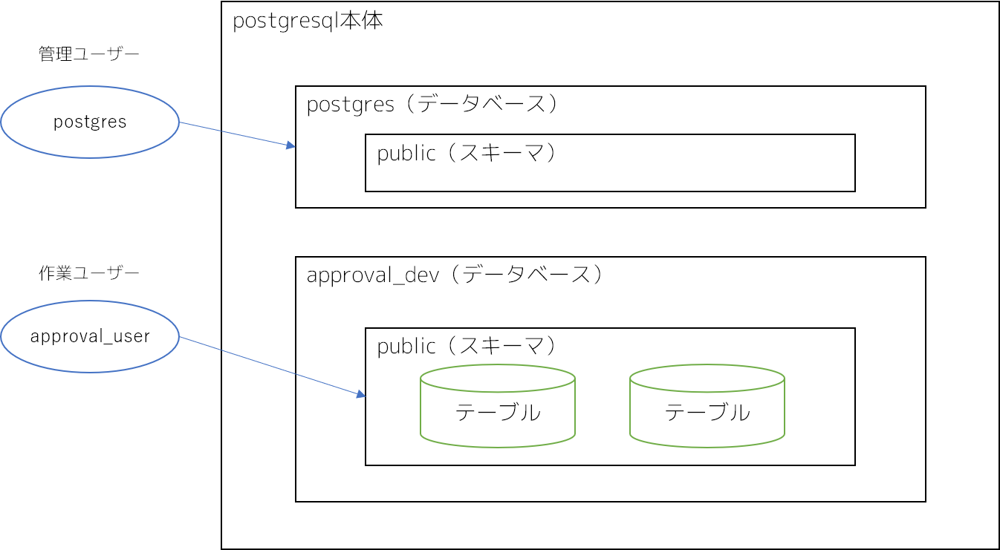

# 各概念確認のための構成図



# 管理ユーザーで接続

```
psql -h database-1.ckpru3dte42n.ap-northeast-1.rds.amazonaws.com -U postgres
```

# 作業ユーザーで接続

```
psql -h database-1.ckpru3dte42n.ap-northeast-1.rds.amazonaws.com -U approval_user -d approval_dev
```

# コマンド

- `\du` : ユーザー一覧表示
- `\l` : データベース一覧表示
- `\dn` : スキーマ一覧表示
